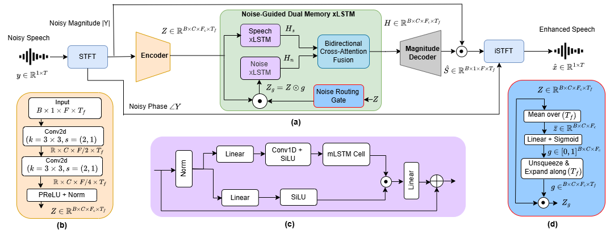

# NGDM-SE: Noise-Guided Dual-Memory xLSTM for Single Channel Speech Enhacement (Submitted in ICASSP 2027 for Possible Publication) #

This repo contains the implementation of the NGDM-SE: Noise-Guided Dual-Memory xLSTM for Single Channel Speech Enhacement paper. Code to download and extract the dataset is available here.

# Model #

